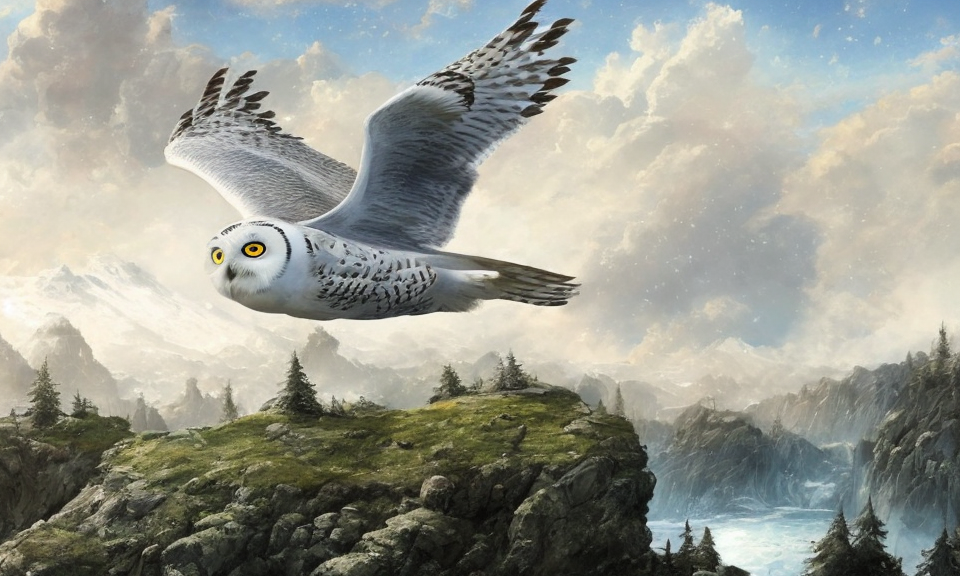
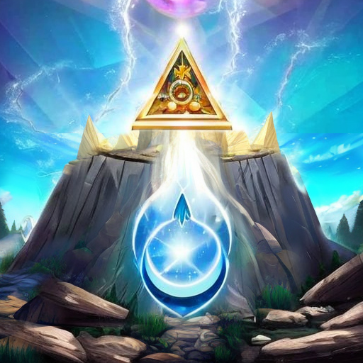
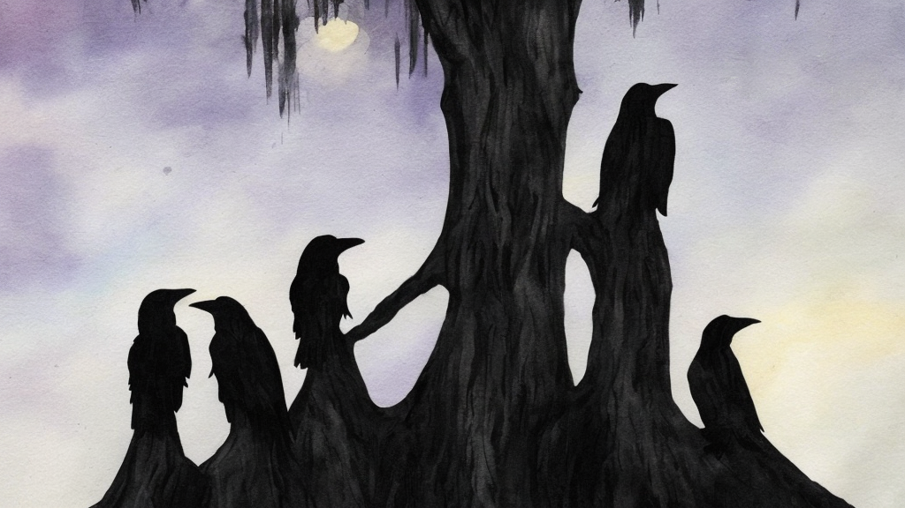
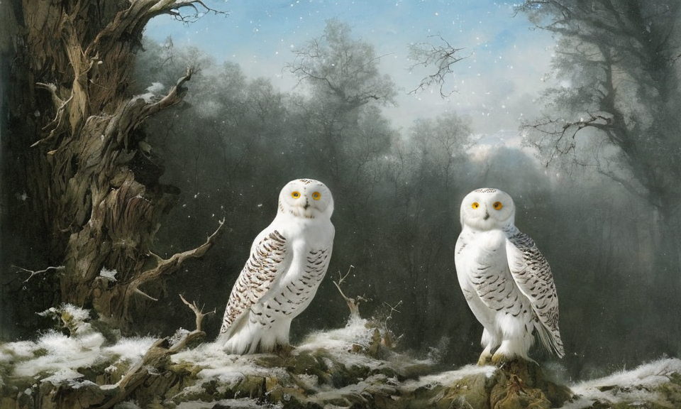
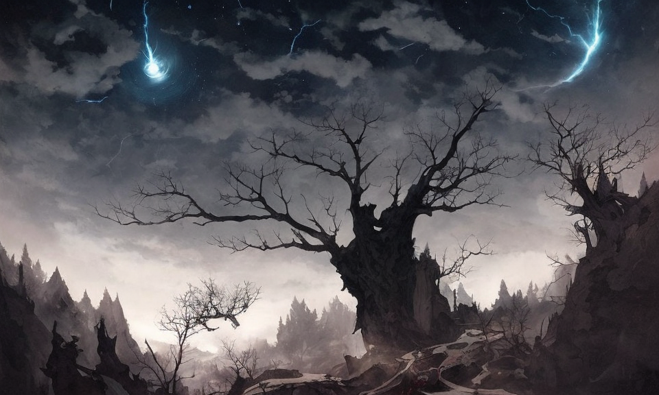
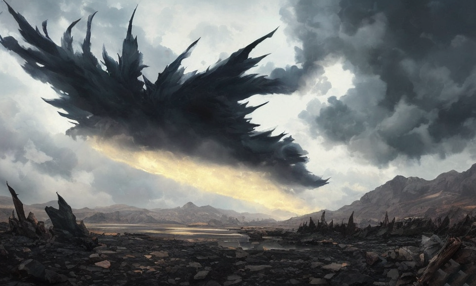
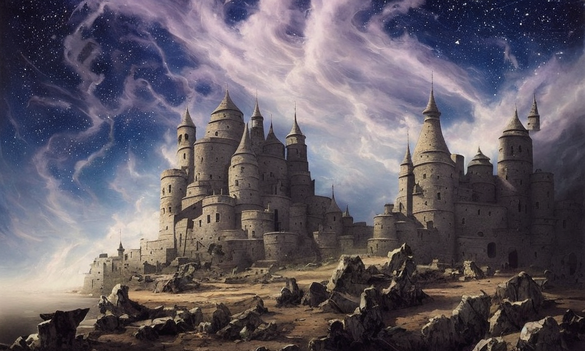
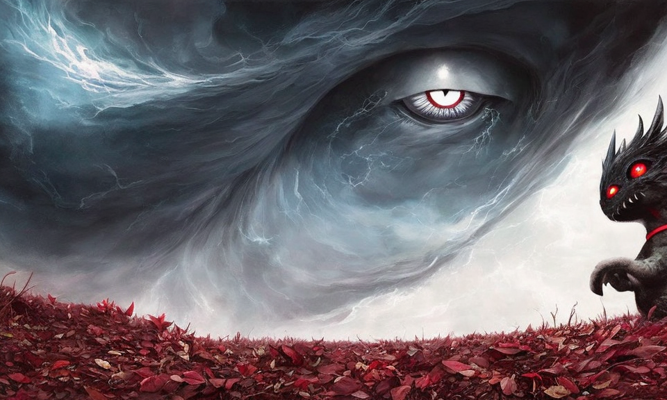
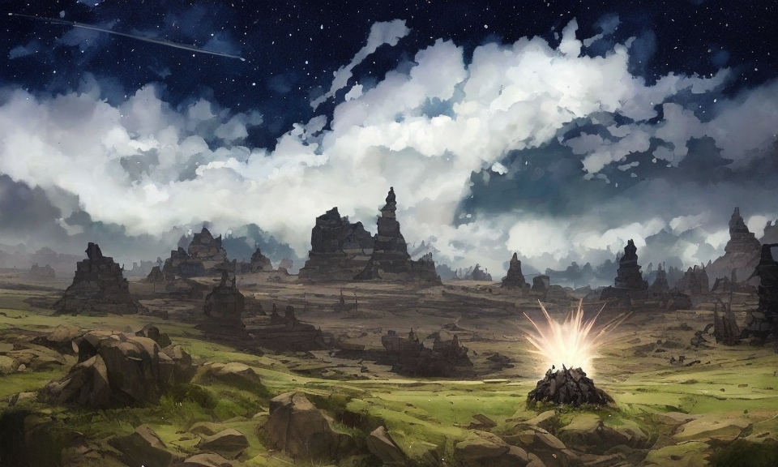
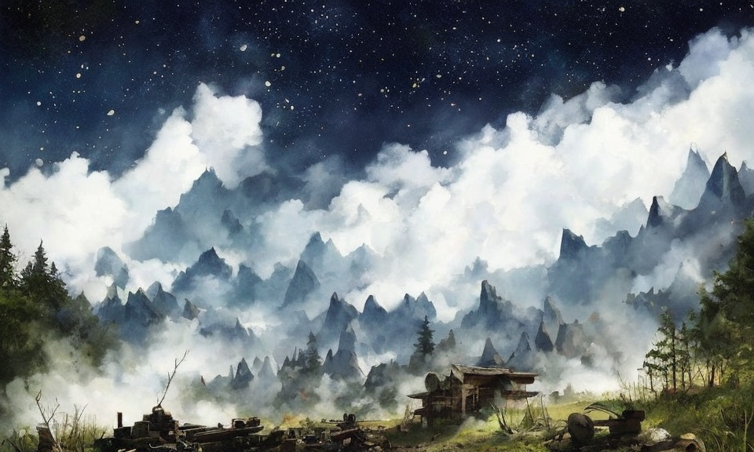

# Le harfang des neiges

Voici une histoire fantastique écrite à l'aide de GPT-4.  
Images créées avec Stable Diffusion.

### Acte 1
> Raconte-moi une histoire, celle de Neh'kiamo le harfang des neiges qui pris son vol dans les comtés lointaines du Saar'khal.

Voici l’histoire de Neh’kiamo le harfang des neiges qui pris son vol dans les comtés lointaines du Saar’khal.

Neh'kiamo était un jeune harfang des neiges qui vivait avec sa famille dans la forêt boréale. Il aimait explorer son territoire et chasser les petits rongeurs qui se cachaient sous la neige. Un jour, il vit un éclat de lumière dans le ciel. C'était une étoile filante qui traçait une longue traînée argentée. Neh'kiamo fut fasciné par ce spectacle et se dit qu'il voulait suivre cette étoile jusqu'à sa destination.

Il décida de quitter sa famille et de prendre son envol vers le sud, où il pensait que l'étoile avait atterri. Il survola des paysages inconnus, des montagnes enneigées, des lacs gelés, des plaines verdoyantes. Il rencontra d'autres oiseaux qui lui parlèrent de leurs coutumes et de leurs légendes. Il apprit que l'étoile qu'il cherchait était en fait un fragment du Saar'khal, le cristal sacré qui protégeait le monde de la nuit éternelle.

Neh'kiamo fut intrigué par cette histoire et voulut en savoir plus. Il continua sa route vers le sud, jusqu'à arriver dans les comtés lointaines du Saar'khal. Là, il vit une grande cité construite autour d'un immense cristal qui brillait de mille feux. C'était le Saar'khal lui-même, le cœur du monde. Neh'kiamo se sentit attiré par cette lumière et s'en approcha. 

Mais il ne se rendit pas compte qu'il était entré dans un piège. Le Saar'khal était gardé par une armée de corbeaux maléfiques qui voulaient s'en emparer pour plonger le monde dans les ténèbres. Ils capturèrent Neh'kiamo et le jetèrent dans une cage. Ils lui dirent qu'ils allaient utiliser son sang pour briser le Saar'khal et libérer leur maître, le roi des corbeaux.

Neh'kiamo se sentit perdu et désespéré. Il regretta d'avoir quitté sa famille et d'avoir suivi son rêve. Il pensa qu'il allait mourir sans avoir jamais revu l'étoile filante qui avait éveillé sa curiosité. Mais il n'était pas seul. Dans la cage voisine, il y avait une autre harfang des neiges qui s'appelait Nira'lani. Elle lui dit qu'elle était venue elle aussi pour voir le Saar'khal et qu'elle avait été capturée par les corbeaux.

Elle lui dit aussi qu'elle connaissait un moyen de s'échapper et de sauver le Saar'khal. Elle lui montra un petit morceau de cristal qu'elle avait caché sous ses plumes. C'était l'étoile filante que Neh'kiamo avait vue dans le ciel ! Elle lui expliqua que ce morceau était un don du Saar'khal pour ceux qui avaient foi en lui et en la lumière. Elle lui dit qu'ils pouvaient utiliser ce morceau pour briser leurs cages et libérer les autres prisonniers.

Neh'kiamo retrouva espoir et accepta de suivre Nira'lani dans son plan audacieux. Ils attendirent la nuit tombée, quand les corbeaux étaient endormis ou distraits par leurs sombres rituels. Ils utilisèrent alors le morceau de cristal pour couper les barreaux de leurs cages et sortirent discrètement de leur prison.

Ils coururent vers le Saar'khal en évitant les sentinelles corbeaux. Ils arrivèrent au pied du cristal géant et virent avec horreur que les corbeaux avaient creusé une profonde entaille dans sa surface. Ils comprirent qu'ils n'avaient pas beaucoup de temps avant que les corbeaux n’achèvent leur œuvre maléfique.

 
Neh'kiamo et Nira'lani se regardèrent et se firent un signe de tête. Ils savaient ce qu'ils devaient faire. Ils prirent le morceau de cristal et le placèrent dans l'entaille du Saar'khal. Ils espéraient que ce geste suffirait à réparer le cristal et à repousser les corbeaux.

Mais ils ne s'attendaient pas à ce qui se passa ensuite. Le morceau de cristal s'illumina d'une vive lumière qui se propagea dans tout le Saar'khal. Le cristal se mit à vibrer et à émettre un son puissant qui résonna dans toute la cité. Les corbeaux furent réveillés par ce vacarme et virent avec stupeur que leur plan avait échoué. 

Ils se précipitèrent vers le Saar'khal pour arracher le morceau de cristal et achever leur œuvre. Mais ils furent repoussés par une onde de choc qui les fit tomber à terre. Le Saar'khal avait retrouvé sa force et sa splendeur. Il émit un rayon de lumière qui balaya les corbeaux hors de la cité.

Neh'kiamo et Nira'lani restèrent éblouis par ce spectacle. Ils sentirent une chaleur les envahir, comme si le Saar'khal les remerciait pour leur courage et leur dévouement. Ils entendirent une voix douce dans leur esprit qui leur dit : "Vous avez sauvé le monde de la nuit éternelle. Vous êtes les élus du Saar'khal, les gardiens de la lumière. Vous avez accompli votre destinée."

Neh'kiamo et Nira'lani se regardèrent avec tendresse. Ils comprirent qu'ils étaient liés par un lien plus fort que l'amitié ou l'amour. Ils étaient liés par le Saar'khal lui-même.

Ils décidèrent de rester dans la cité du Saar'khal pour veiller sur lui et sur ses habitants.  
Ils devinrent des héros respectés et admirés par tous.  
Ils vécurent heureux ensemble jusqu'à la fin de leurs jours.  
Et c'est ainsi que Neh'kiamo le harfang des neiges pris son vol dans les comtés lointains du Saar'khal.

---
### Acte 2
> Rendu à la fin de leurs jours, à la fin du dernier jour de leur histoire, ils fermèrent les yeux pour une dernière fois. C'est alors que le Nakyo'aahl leur ont donné une autre histoire, une autre mission à accomplir. Ils sont maintenant en pleine forme avec un gain de vitalité sans pareil. Est-ce trop peu, trop tard pour vaincre le néant qui envahit toute la région ?

Neh'kiamo et Nira'lani avaient vécu une longue et belle vie dans la cité du Saar'khal. Ils avaient vu le monde changer autour d'eux, mais ils étaient restés fidèles à leur mission de gardiens de la lumière. Ils avaient eu des enfants et des petits-enfants qui avaient perpétué leur héritage. Ils étaient aimés et respectés par tous.

Mais un jour, ils sentirent que leur force les quittait. Ils savaient que leur heure était venue. Ils se réunirent une dernière fois au pied du Saar'khal et se prirent la main. Ils fermèrent les yeux pour une dernière fois.

Mais ils ne s'attendirent pas à ce qui se passa ensuite. Au lieu de sombrer dans le sommeil éternel, ils se réveillèrent dans un autre monde. Un monde où le ciel était noir et où le sol était couvert de cendres. Un monde où régnait le silence et le froid.

Ils virent alors apparaître devant eux une créature étrange. C'était un Nakyo'aahl, un être de lumière qui vivait dans le Saar'khal. Il leur dit : "Vous avez été choisis par le Saar'khal pour accomplir une nouvelle mission. Vous êtes les seuls à pouvoir sauver ce monde du néant qui l'envahit."

Neh'kiamo et Nira'lani furent surpris par ces paroles. Ils demandèrent : "Quel est ce monde ? Quel est ce néant ? Pourquoi nous avoir choisis ?"  
Le Nakyo'aahl leur répondit : "Ce monde est l'un des nombreux mondes que le Saar'khal protège de la nuit éternelle. Mais il a été attaqué par une force maléfique qui veut détruire toute forme de vie : le néant. Le néant est une entité sans nom ni forme qui se nourrit de la lumière et de l'énergie des mondes qu'il envahit.  
Vous avez été choisis car vous êtes les élus du Saar'khal, les gardiens de la lumière. Vous avez prouvé votre courage et votre dévouement en sauvant votre propre monde du même péril. Vous avez reçu en cadeau une nouvelle vie, une nouvelle chance de combattre le mal. Votre mission est simple : trouver le cœur de ce monde, là où réside sa source de lumière, et y placer un morceau du Saar'khal pour restaurer son équilibre et repousser le néant."  

Neh'kiamo et Nira'lani furent impressionnés par cette mission. Ils se sentirent à la fois honorés et effrayés par cette responsabilité.
Ils regardèrent autour d'eux et virent un paysage désolé et hostile.
Ils se demandèrent comment ils allaient réussir à trouver le cœur de ce monde sans guide ni indice.

Mais ils n'eurent pas le temps d'hésiter longtemps. Le Nakyo'aahl leur tendit un petit morceau de cristal qui brillait faiblement dans sa main. Il leur dit : "Voici le morceau du Saar'khal que vous devez placer dans le cœur de ce monde. Il vous aidera à trouver votre chemin en vous indiquant la direction à suivre. Mais faites vite, car vous n'avez pas beaucoup de temps avant que le néant ne consume tout." Puis il disparut en laissant Neh'kiamo et Nira'lani seuls face à leur destin.

Ils prirent alors courageusement le morceau du Saar'khal et commencèrent leur périple vers le cœur du monde.

Neh'kiamo et Nira'lani marchèrent pendant des heures dans le monde sombre et désert. Ils ne virent aucune trace de vie, ni végétale ni animale. Ils ne croisèrent que des ruines de ce qui avait dû être autrefois des villes ou des villages. Ils se demandèrent ce qui avait pu arriver à ce monde pour qu'il devienne ainsi.

Ils suivirent le morceau du Saar'khal qui leur indiquait la direction à prendre. Ils remarquèrent que plus ils avançaient, plus le morceau brillait fort. Ils en déduisirent qu'ils se rapprochaient du cœur du monde.

Mais ils remarquèrent aussi que plus ils avançaient, plus le froid se faisait intense. Ils sentirent leurs corps se raidir et leurs forces s'affaiblir. Ils comprirent qu'ils étaient en train d'entrer dans le domaine du néant.

Ils décidèrent alors de s'arrêter pour se reposer et se réchauffer. Ils trouvèrent un abri sous un rocher et allumèrent un feu avec les quelques branches qu'ils avaient ramassées en chemin. Ils mangèrent un peu de leur maigre provision et se serrèrent l'un contre l'autre pour se donner du courage.

Ils parlèrent alors de leur vie passée, de leur famille, de leurs amis, de leurs souvenirs heureux. Ils se dirent qu'ils espéraient les revoir un jour, si le Saar'khal le voulait bien. Ils se dirent aussi qu'ils étaient fiers d'avoir accompli leur mission de gardiens de la lumière et qu'ils étaient prêts à recommencer si c'était nécessaire.

Ils s'endormirent ensuite paisiblement dans les bras l'un de l'autre.

Mais ils ne s'attendirent pas à ce qui se passa ensuite. Pendant qu'ils dormaient, une ombre rampa vers eux depuis les ténèbres environnantes. C'était une créature du néant, une sorte de ver géant aux yeux rouges et aux dents acérées. Il avait senti la présence du morceau du Saar'khal et était attiré par sa lumière.

La créature du néant s'approcha lentement de Neh'kiamo et Nira'lani, prête à les attaquer pendant leur sommeil. Mais alors qu'elle était sur le point de les saisir, le morceau du Saar'khal émit une faible lueur qui réveilla Neh'kiamo.

En apercevant la créature, il réagit rapidement et poussa Nira'lani hors de sa portée. Ils se levèrent et firent face à la créature, prêts à se défendre. Le ver géant, voyant qu'il avait été découvert, se rua sur eux avec une féroce détermination.

Neh'kiamo et Nira'lani esquivèrent ses attaques en s'aidant de leur agilité naturelle et de leur expérience de chasseurs. Ils comprirent qu'ils devaient trouver un moyen de vaincre la créature avant qu'elle ne les épuise et ne les tue.

Ils se souvinrent alors de la puissance du Saar'khal et décidèrent de l'utiliser contre la créature du néant. Ils prirent le morceau de cristal et le brandirent devant eux, en se concentrant sur sa lumière et sur leur volonté de protéger le monde.

Le morceau du Saar'khal répondit à leur appel et brilla d'une vive lumière qui les enveloppa et les protégea. La créature du néant recula, aveuglée et blessée par la lumière. Elle poussa un hurlement de douleur et de colère avant de disparaître dans les ténèbres.

Neh'kiamo et Nira'lani savaient qu'ils avaient gagné une bataille, mais pas la guerre. Ils devaient se dépêcher de trouver le cœur du monde et de restaurer sa lumière avant que d'autres créatures du néant ne viennent les attaquer.

Ils reprirent leur route, guidés par le morceau du Saar'khal qui brillait de plus en plus fort à mesure qu'ils s'approchaient du cœur du monde. Ils traversèrent des paysages dévastés par le néant, des forêts de cristal brisé et des rivières de glace.

Finalement, ils arrivèrent devant une immense fissure dans le sol qui s'étendait à perte de vue. Au fond de cette fissure, ils virent un cœur de lumière qui palpitait faiblement, menacé par l'obscurité qui l'entourait. C'était le cœur du monde, la source de sa lumière et de son énergie.

Neh'kiamo et Nira'lani se regardèrent et prirent une profonde inspiration. Ils savaient que c'était le moment décisif, celui où ils devaient accomplir leur mission et sauver ce monde du néant.

Ils prirent le morceau du Saar'khal et le lancèrent dans la fissure, en priant pour qu'il atteigne le cœur du monde et le restaure. Le morceau de cristal traversa l'obscurité comme une étoile filante et percuta le cœur de lumière.

Soudain, une explosion de lumière jaillit de la fissure et se propagea dans tout le monde. Les paysages dévastés par le néant se régénérèrent, les forêts de cristal brisé reprirent vie et les rivières de glace fondirent pour donner naissance à des cours d'eau clairs et scintillants. La lumière du cœur du monde était revenue, chassant les ténèbres et les créatures du néant.

Les habitants du monde, qui avaient vécu dans la peur et le désespoir, sentirent la lumière revenir et un nouvel espoir naquit en eux. Ils sortirent de leurs abris et contemplèrent le monde restauré, émerveillés par sa beauté et sa splendeur.

Neh'kiamo et Nira'lani, épuisés mais heureux, se tinrent debout au bord de la fissure, contemplant le cœur du monde qui palpitait maintenant avec force et lumière. Ils savaient qu'ils avaient accompli leur mission et que leur monde était sauvé.

La légende de leur quête se répandit rapidement à travers les terres et les peuples. Neh'kiamo et Nira'lani furent célébrés comme les héros qui avaient sauvé le monde du néant, et leur nom devint synonyme de courage et de détermination.

Le temps passa, et la vie reprit son cours normal. Les habitants du monde reconstruisirent leurs maisons et leurs villes, et la nature reprit ses droits sur les terres dévastées. Mais personne n'oublia jamais l'histoire de Neh'kiamo et Nira'lani, et leur légende fut transmise de génération en génération.

Quant à Neh'kiamo et Nira'lani, ils continuèrent à explorer le monde, toujours à la recherche de nouvelles aventures et de défis à relever. Et même si la menace du néant était écartée, ils restaient vigilants, prêts à protéger leur monde et ceux qu'ils aimaient, peu importe les épreuves qu'ils devraient affronter.

Ainsi, le monde retrouva sa paix et sa prospérité, et l'histoire de Neh'kiamo et Nira'lani devint une légende, un récit d'amitié, de courage et de sacrifice qui inspirerait les générations futures à croire en leur propre force et à lutter pour la lumière, même dans les moments les plus sombres.

FIN