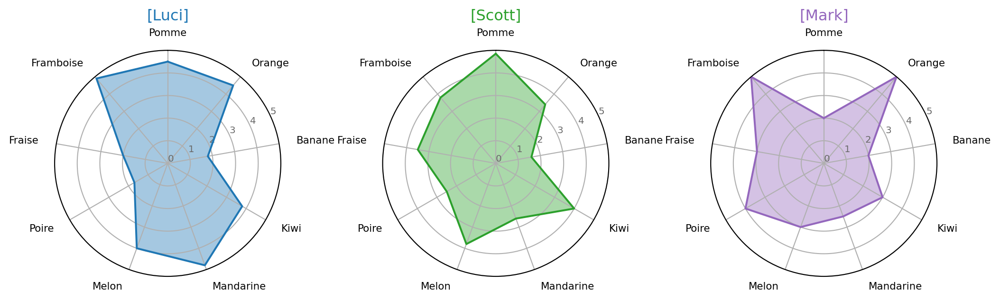

# Radar chart

Il existe plusieurs méthodes pour représenter l'information, des chiffres, des tableaux, des diagrammes.

Une forme de diagramme qui est souvent peu utilisé est le <abbr title="Aussi connu sous le nom «diagramme en radar»">diagramme de Kiviat</abbr>, qui représente sous la forme de pointe de tarte différentes informations.

Dans cet article, je décrirai les méthodes pour réaliser un graphiques tels que celui-ci.




Le graphique est fait en utilisant la librairie [matplotlib](https://matplotlib.org/), qui permets la visualisation de graphiques à l'aide de Python.


Pour les données, prennons ce tableau représentant la préférence de 9 fruits de 3 différentes personnes.

|           	| Luci 	| Scott 	| Mark 	|
|-----------	|------:|-------:	|------:|
| Pomme     	| 4.5  	| 4.85  	| 2    	|
| Orange    	| 4.5  	| 3.4   	| 4.5  	|
| Banane    	| 1.8  	| 1.6   	| 2    	|
| Kiwi      	| 3.8  	| 4     	| 3    	|
| Mandarine 	| 4.8  	| 2.6   	| 2.5  	|
| Melon     	| 4    	| 3.8   	| 3    	|
| Poire     	| 1.7  	| 2.5   	| 4    	|
| Fraise    	| 2    	| 3.5   	| 3    	|
| Framboise 	| 4.9  	| 3.8   	| 5    	|

Pour garder les données en mémoire, l'un des formats recommandé est l'utilisation de dataframe, un élément de la librairie [pandas](https://pandas.pydata.org/).

```python
import matplotlib.pyplot as plt
import pandas as pd
from math import pi

# Mise en place des données
df = pd.DataFrame({
'groupe': ['Luci','Scott','Mark'],
'Pomme' : [4.5,4.85,2],
'Orange': [4.5,3.4,5],
'Banane': [1.8,1.6,2],
'Kiwi':   [3.8,4,3],
'Ananas': [4.8,2.6,2.5],
'Melon':  [4,3.8,3],
'Poire':  [1.7,2.5,4],
'Fraise': [2,3.5,3],
'Datte':  [4.9,3.8,5]
})
```

En effectuant un `print(df)`, nous avons le résultat des données en mémoire.

```
  groupe  Pomme  Orange  Banane  Kiwi  Ananas  Melon  Poire  Fraise  Datte
0   Luci   4.50     4.5     1.8   3.8     4.8    4.0    1.7     2.0    4.9
1  Scott   4.85     3.4     1.6   4.0     2.6    3.8    2.5     3.5    3.8
2   Mark   2.00     5.0     2.0   3.0     2.5    3.0    4.0     3.0    5.0
```

::: warning Section en progression
Article en cours d'écriture.
:::