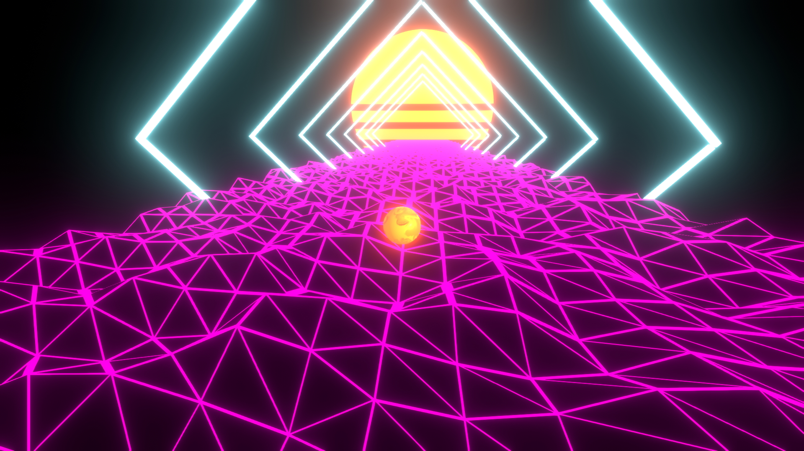
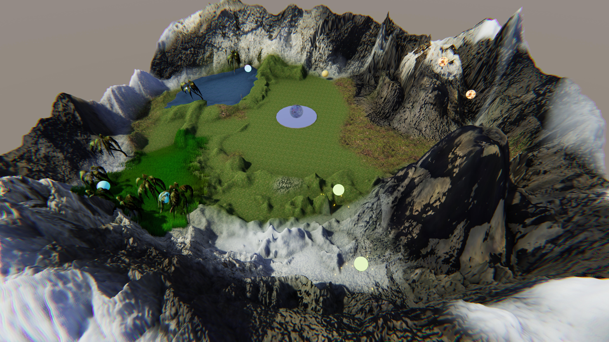
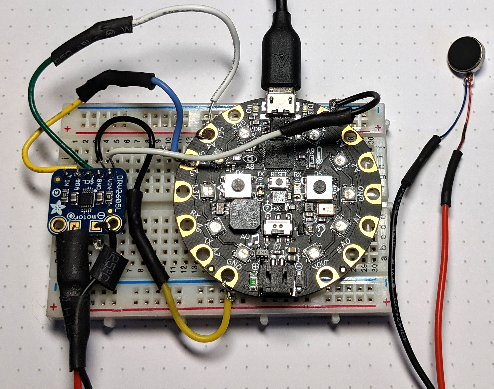
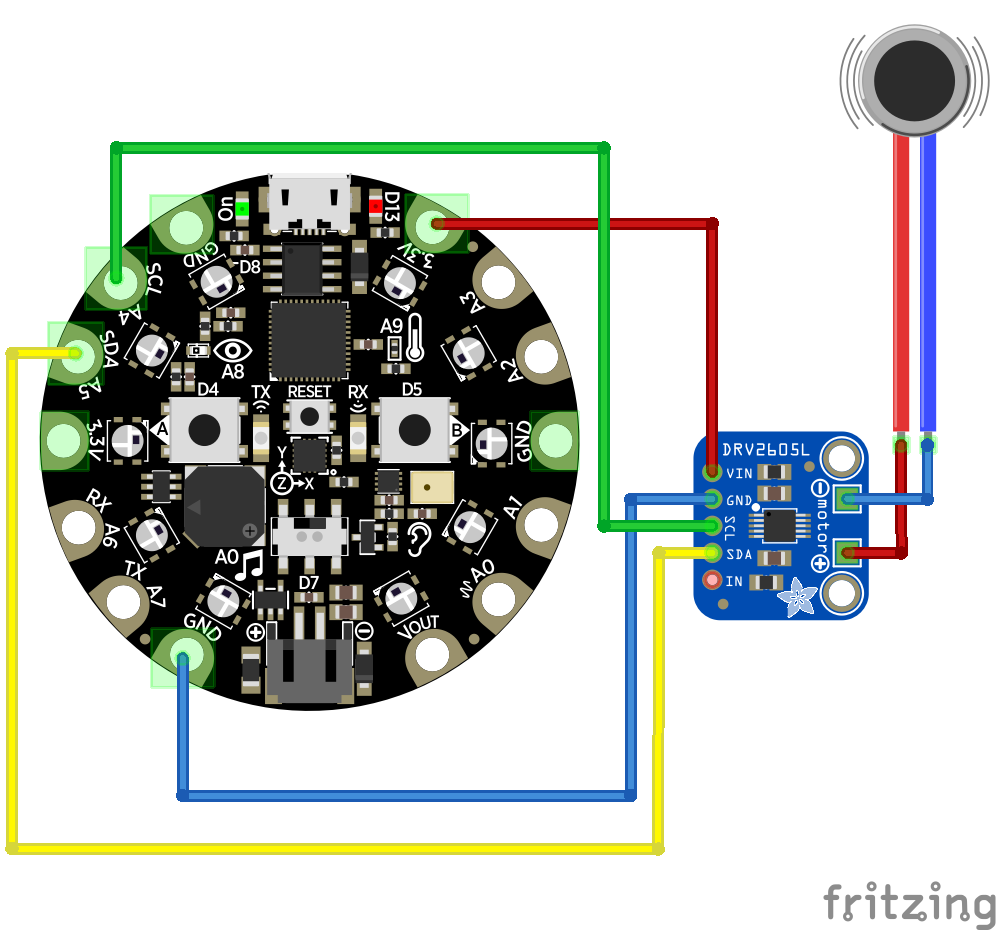

<!-- # Portfolio

## Unity

### Weekend at the chalet
> `Unity 2019.1.14f1`

>*What will be an ideal weekend ?*
Be quiet at the chalet, a small campfire, listen to nature and doze off at a sunset.

Completely made with free assets, sound recorded myself and cleaned with Audacity.

**Video**

    <iframe style="position:absolute;top:0;left:0;width:100%;height:100%;" src="https://www.youtube-nocookie.com/embed/1sNtYfWZV08" frameborder="0" allow="accelerometer; autoplay; encrypted-media; gyroscope; picture-in-picture" allowfullscreen></iframe>

### Inverted maze

> `Unity 2019.1.14f1` `Bosca Ceoil` `AI` `NavMesh` - August 2019

Build using the Unity [NavMesh](https://docs.unity3d.com/Manual/nav-BuildingNavMesh.html) and music made with [Bosca Ceoil](https://boscaceoil.net/).

::: warning In development
An update with the link on the Google Play Store is coming soon.
:::

**Video with sound**
<video width="100%" height="100%" controls :src="$withBase('/img/aiMaze/video_aiMaze.webm')" type="video/mp4"></video>

### Roll in the 80s
Unity 2019.1.13f1 - August 2019

A rolling ball, how to make the concept more interesting?

Synthwave !

- Using perspectives simulating an endless progress
- The ball interacts with the ground and tries to find the best way to advance
- Arches giving a sense of progress
- [Online version](https://lefebvre.dev/demo_unity_80s_WebGL/index.html) ((the ground is different due to an incompatibility with the shader in WebGL)
- Code available on [GitHub](https://github.com/SamLefebvre/retro-80s-wireframe)

### Music generator
Unity 2019.1.1f1 - August 2019

As part of my course *GTI745 - Interfaces utilisateurs avancées* at ÉTS, the last labo was to make a game to create music. A wonderful team work in just a few weeks.

** Main interface **: Musical sequencer with a console for adjusting the sound.

**Video on Youtube**

    <iframe style="position:absolute;top:0;left:0;width:100%;height:100%;" src="https://www.youtube-nocookie.com/embed/embed/UJGDZKN5E0o" frameborder="0" allow="accelerometer; autoplay; encrypted-media; gyroscope; picture-in-picture" allowfullscreen></iframe>

- Using [Leap Motion](https://www.leapmotion.com/), to control the elements of the matrix in real time with our hands for a more immersive control.

**A (small) world to explore**: The player has to walk in a 3d world to pick up different musical elements.

- Package [Terrain Tools](https://docs.unity3d.com/Packages/com.unity.terrain-tools@latest)
- [Terrain Tools Sample Asset Pack](https://assetstore.unity.com/packages/2d/textures-materials/terrain-tools-sample-asset-pack-145808)

**Haptic device (vibration)**: Allows a small sensation to the user when "touching" an object, specifically when the *Leap Motion* comes into contact with an element of the matrix.

- Controlled vibrotactile motor with python on embedded system
  - [Vibrating Mini Motor Disc](https://www.adafruit.com/product/1201)
  - [Adafruit DRV2605L Haptic Motor Controller](https://www.adafruit.com/product/2305)
  - [Circuit Playground Express](https://www.adafruit.com/product/3333)

**Diagram of the electrical circuit**

- Drawn using [Fritzing](https://fritzing.org/home/)

## Web site

### [Expensify](https://cryptic-woodland-49105.herokuapp.com)

> `React`

Made in the Udemy React couse [The Complete React Developer Course](https://www.udemy.com/react-2nd-edition).

- React 16.8.6
- Login with Firebase
- Test with [Enzyme](https://airbnb.io/enzyme/)

### [SynapsÉTS](https://synapsets.etsmtl.ca)

> `Vuepress` `GitHub Page`

SynapsÉTS is a new science-based student club of the École de Technologie Supérieure and specialized in brain-machine interface (ICM / BCI). Bringing together all areas of expertise of the university, this group of students focuses its activities around the analysis and processing of cerebral signals and in the development of technologies in this area.

 -->
