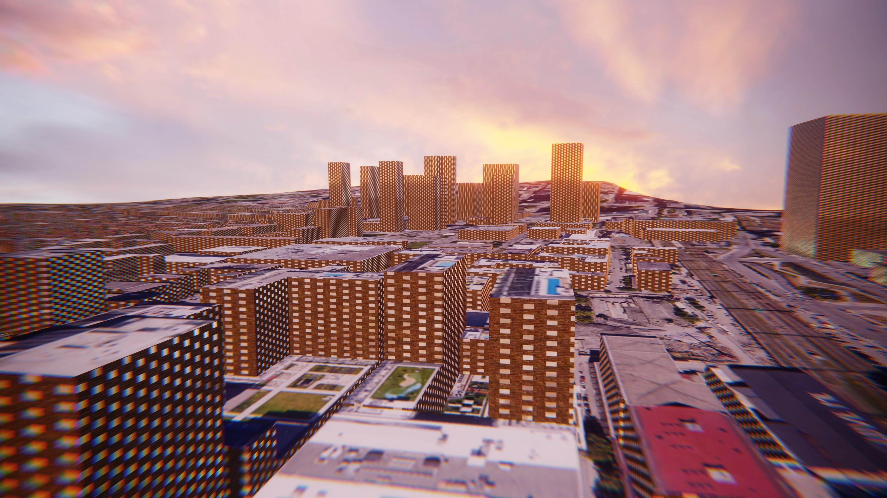
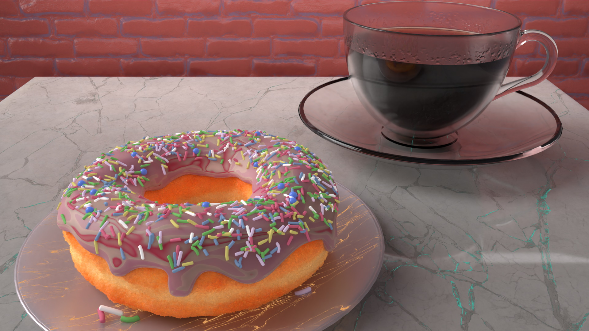

# Blender

## Griffintown
> `Blender 2.83.1` `4k` - 13 July 2020

Reusing the scene created for [Neon City](#neon-city), I applied a texture to the ground, a [brick](https://texturehaven.com/tex/?c=bricks&t=random_bricks_thick) texture, and a shader to create the windows. HDRI from [HDRIHaven](https://hdrihaven.com/hdri/?h=the_sky_is_on_fire).

## Neon City
> `Blender 2.83.1` `4k` `60fps` - 10 June 2020

The [Blender GIS](https://github.com/domlysz/BlenderGIS) extension makes it possible to import 3D terrain. With the same extension, it is also possible to obtain a model of the buildings.

<!-- 

    <iframe style="position:absolute;top:0;left:0;width:100%;height:100%;" src="https://www.youtube-nocookie.com/embed/YxuYwCPVAFw" frameborder="0" allow="accelerometer; autoplay; gyroscope; picture-in-picture" allowfullscreen></iframe>

 -->

<iframe width="560" height="315" src="https://www.youtube-nocookie.com/embed/YxuYwCPVAFw" frameborder="0" allow="accelerometer; autoplay; clipboard-write; encrypted-media; gyroscope; picture-in-picture" allowfullscreen></iframe>

## Tracking
> `Blender 2.83.1` `RTMG` `4k` `60fps` - 4 June 2020

Python code was added to get the object’s position in the scene and then display it on screen by simulating GPS coordinates.
Fourth project based on the course [Real Time Motion Graphics](https://blendermarket.com/products/rtmg) by [Midge "Mantissa" Sinnaeve](https://mantissa.xyz/).

    <iframe style="position:absolute;top:0;left:0;width:100%;height:100%;" src="https://www.youtube-nocookie.com/embed/wxQXmuWxT7U" frameborder="0" allow="accelerometer; autoplay; encrypted-media; gyroscope; picture-in-picture" allowfullscreen></iframe>

## Stopping Time
> `Blender 2.83.1` - 2 June 2020

Using the [Cell Fracture](https://docs.blender.org/manual/en/2.83/addons/object/cell_fracture.html) extension, I experimented with creating a time-stop effect that makes it possible to reposition the camera.

<video controls width="500"><source :src="$withBase('/videos/glass_breaking.webm')" type="video/webm">
    Sorry, your browser doesn't support embedded videos.
</video>

## Walking
> `Blender 2.83.1` `RTMG` `4k` `60fps` - 30 June 2020

Model created using the [MB-LAB](https://mb-lab-community.github.io/MB-Lab.github.io/) character creation addon.
Third project based on the course [Real Time Motion Graphics](https://blendermarket.com/products/rtmg) by [Midge "Mantissa" Sinnaeve](https://mantissa.xyz/).

    <iframe style="position:absolute;top:0;left:0;width:100%;height:100%;" src="https://www.youtube-nocookie.com/embed/or8DTeMgZYA" frameborder="0" allow="accelerometer; autoplay; encrypted-media; gyroscope; picture-in-picture" allowfullscreen></iframe>

## Metallic Waves
> `Blender 2.83.1` `RTMG` `4k` `60fps` - 25 June 2020

Second project based on the course [Real Time Motion Graphics](https://blendermarket.com/products/rtmg) by [Midge "Mantissa" Sinnaeve](https://mantissa.xyz/).
A few modifications were made to create a looping animation.

    <iframe style="position:absolute;top:0;left:0;width:100%;height:100%;" src="https://www.youtube-nocookie.com/embed/v-YtyXE1mYw" frameborder="0" allow="accelerometer; autoplay; encrypted-media; gyroscope; picture-in-picture" allowfullscreen></iframe>

## Flag
> `Blender 2.83.1` - 24 June 2020

To celebrate [Quebec's National Holiday](https://fr.wikipedia.org/wiki/F%C3%AAte_nationale_du_Qu%C3%A9bec), I animated a flag.
Creation time: 30 min.
Render time: 45 min.

<video controls width="500"><source :src="$withBase('/videos/drapeau_quebec.webm')" type="video/webm">
    Sorry, your browser doesn't support embedded videos.
</video>

## Oh No
> `Blender 2.83.1` `Cloth Simulation` - 24 June 2020

Nightmarish creations? Yes.
Inspired by Ian Hubert, [Make Nightmare Men in Blender - Lazy Tutorials](https://www.youtube.com/watch?v=bgfJIZEDY44)

    <iframe style="position:absolute;top:0;left:0;width:100%;height:100%;" src="https://www.youtube-nocookie.com/embed/SZ8DcUSDpNY" frameborder="0" allow="accelerometer; autoplay; encrypted-media; gyroscope; picture-in-picture" allowfullscreen></iframe>

## Into the Void
> `Blender 2.83.1` `Animation` `Perfect Loop` `RTMG` - 20 June 2020

Perfect loop style animation, meaning there is no visible cut, based on concepts from the course [Real Time Motion Graphics](https://blendermarket.com/products/rtmg) by [Midge "Mantissa" Sinnaeve](https://mantissa.xyz/)

    <iframe style="position:absolute;top:0;left:0;width:100%;height:100%;" src="https://www.youtube-nocookie.com/embed/uThf61oX4xI" frameborder="0" allow="accelerometer; autoplay; encrypted-media; gyroscope; picture-in-picture" allowfullscreen></iframe>

## Donut

Donut created by following the [Blender Beginner Tutorial Series](https://www.youtube.com/playlist?list=PLjEaoINr3zgEq0u2MzVgAaHEBt--xLB6U) on YouTube by [Blender Guru](https://www.youtube.com/user/AndrewPPrice).

### Donut and Coffee
> `Blender 2.83` - 11 June 2020

### Donut and Physics
> `Blender 2.83` `Physics` - 8 June 2020

I was wondering how to display sugar sprinkles without having positioning conflicts. This short video shows one solution by creating a particle generator where each particle has a Rigid Body. The idea is interesting and works well, but with a computation time of 4 hours, I decided not to keep that approach.

<video controls width="500"><source :src="$withBase('/videos/donut_sprinkles.webm')" type="video/webm">
    Sorry, your browser doesn't support embedded videos.
</video>

## Car Animation
> `Blender 2.82a` - 7 June 2020

The result after following the course [Blender 2.8 Launch Pad](https://academy.cgboost.com/p/blender-2-8-launch-pad).
Creation time: >100 hours. (I did not know Blender beforehand.)
Render time: ~4 hours.

    <iframe style="position:absolute;top:0;left:0;width:100%;height:100%;" src="https://www.youtube-nocookie.com/embed/vCCTq3kAiBY" frameborder="0" allow="accelerometer; autoplay; encrypted-media; gyroscope; picture-in-picture" allowfullscreen></iframe>

## Picnic Table
> `Blender 2.83` `Camera Tracking` - 6 June 2020

Image tracking and replacement with a virtual object.
Creation time: >5 hours.
Render time: ~2 hours.

    <iframe style="position:absolute;top:0;left:0;width:100%;height:100%;" src="https://www.youtube-nocookie.com/embed/BEgiooGMagw" frameborder="0" allow="accelerometer; autoplay; encrypted-media; gyroscope; picture-in-picture" allowfullscreen></iframe>

