# Unity

## Playing with Your Heart
> `Unity 2019.2.17f1` `HCI` - January 2020

During the [ÉTS Open House](https://portesouvertes.etsmtl.ca/), this was one of the projects presented by the SynapsÉTS club.

How can biotechnology, data analysis, data visualisation, fun, and accessibility all be brought together for everyone? In a game, of course!

A heartbeat is detected using a small device. With each heartbeat, the gun gains an extra recharge. So, the faster the heart beats, the easier it is for the player to survive against enemies.

::: tip How it works

Using a <abbr title="A photoplethysmogram">pulse sensor</abbr> placed on the finger, a light and a sensor continuously detect changes in blood flow. As a result, when a heartbeat occurs, a change in voltage is perceived by the sensor, and a heartbeat is detected.

  
Image showing in more detail how it works

<a href="https://learn.adafruit.com/assets/69599">Anne Barela </a>

:::

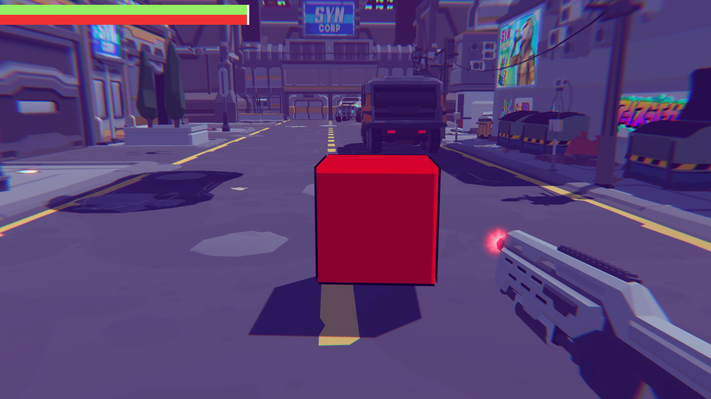
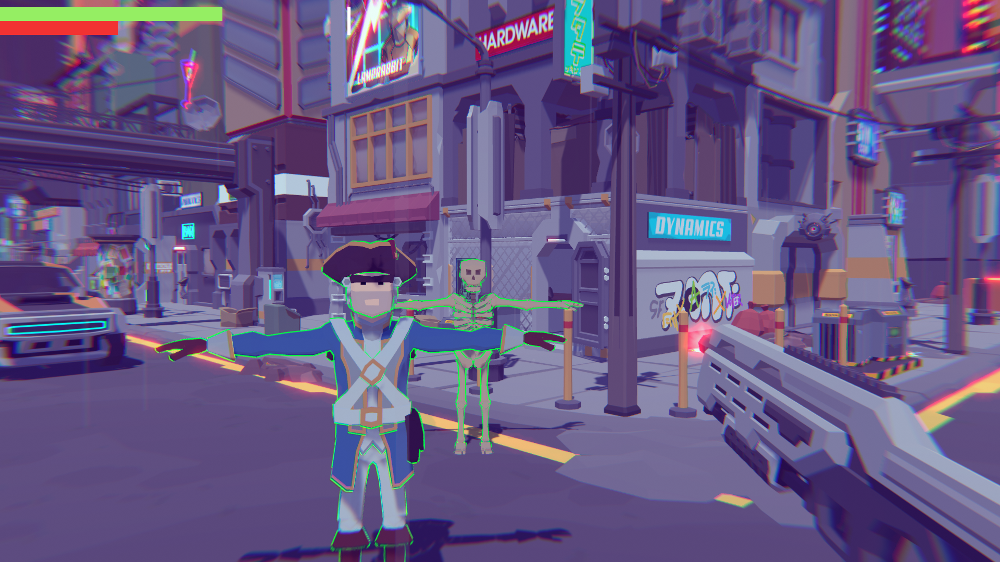
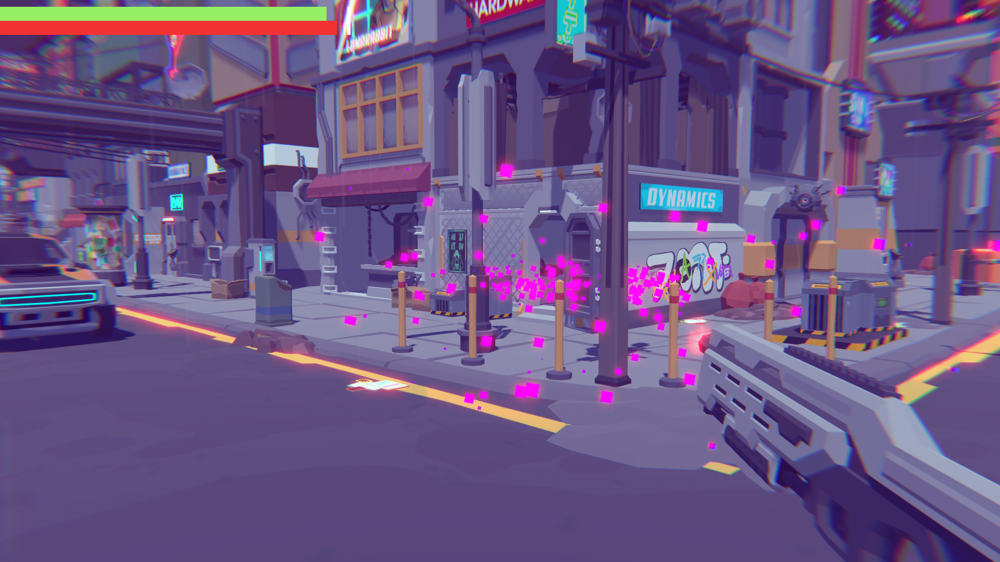

## Low-Poly Racing

> `Unity 2019.2.17f1` `Cinemachine` `Wheel Collider` `Post Processing` - January 2020

In preparation for the [Global Game Jam](https://globalgamejam.org/), our team got together for a few hours to have fun with assets from [Synty Studios](https://syntystore.com/) and learn how to integrate them into Unity.

The car movement was built using Unity’s [Wheel Collider](https://docs.unity3d.com/Manual/class-WheelCollider.html) physics system.

A web demo is [available online](https://ekines.com/hyperracing/). Please note that the movement still needs improvement.

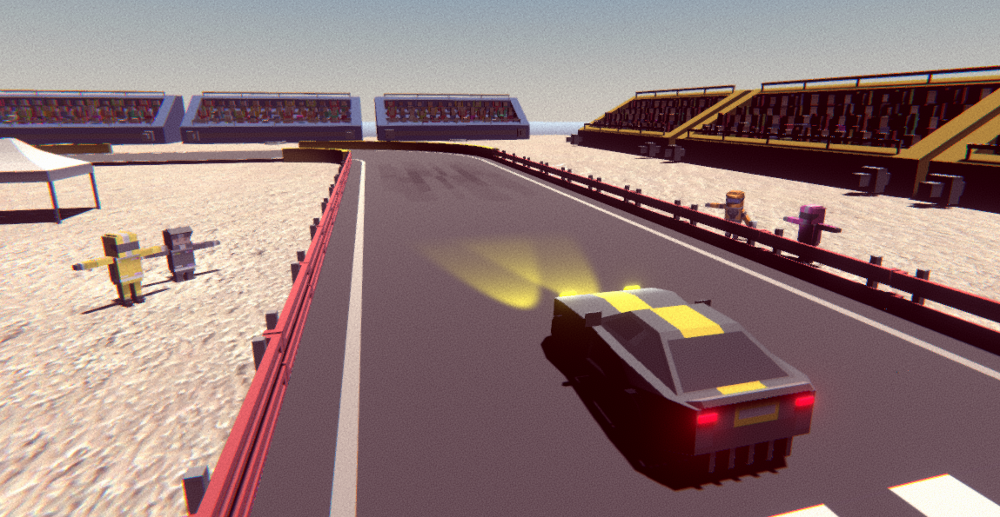
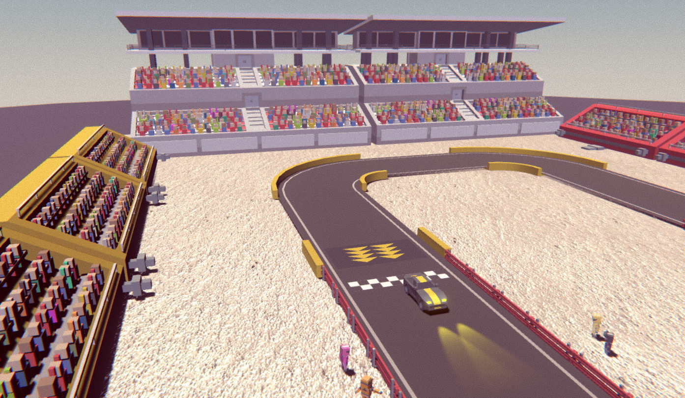

## A Walk in the Forest
> `Unity 2019.2.3f1` `Cinemachine` `Timeline` `Post Processing` `Terrain Tools` - November 2019

> During the month of November, the monthly theme for the [Conjure](https://conjure.etsmtl.ca/) student club at ÉTS was *the power of nature*.

Should I make a simple game? No, that is not really my style.  
Should I make an animation rendered in <abbr title="Smooth real time">real time</abbr> with Unity where I act as director, writer, programmer, animator, and the person in charge of the final render? Yes, that sounds interesting! <abbr title="What have I gotten myself into this time?">:sweat_smile:</abbr>.  
After several iterations and many hours spent learning the different tools, the result came very close to the original vision.

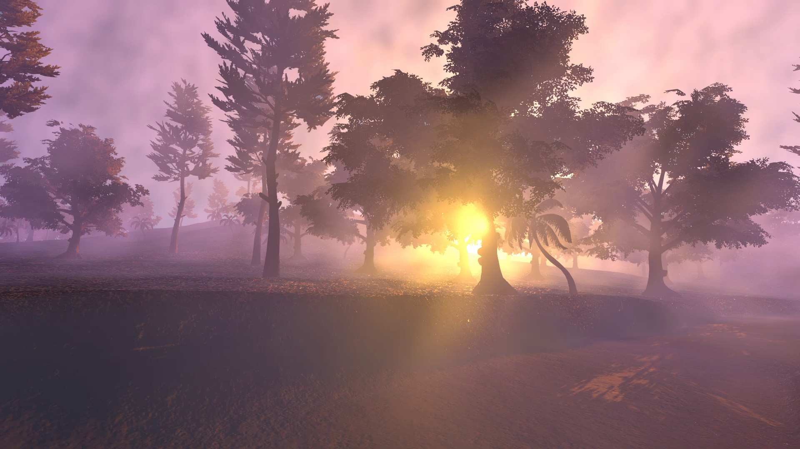

One unexpected challenge was the following: how should the story be told?  
After a few attempts, the subtitled version was kept.

:writing_hand: Special thanks to [Diego Saavedra](https://www.facebook.com/diegosaavedrarenaud) for his help with writing the story.

**Video**

    <iframe style="position:absolute;top:0;left:0;width:100%;height:100%;" src="https://www.youtube-nocookie.com/embed/cQqn5H3E-uw" frameborder="0" allow="accelerometer; autoplay; encrypted-media; gyroscope; picture-in-picture" allowfullscreen></iframe>

## A Weekend at the Cabin
> `Unity 2019.1.14f1` `Animation` - August 2019

>*What would an ideal weekend look like?*  
Being peaceful at the cabin, sitting by a small campfire, listening to nature, and dozing off during sunset.

Created entirely with free assets, with ambient sound recorded by myself and cleaned up using Audacity.

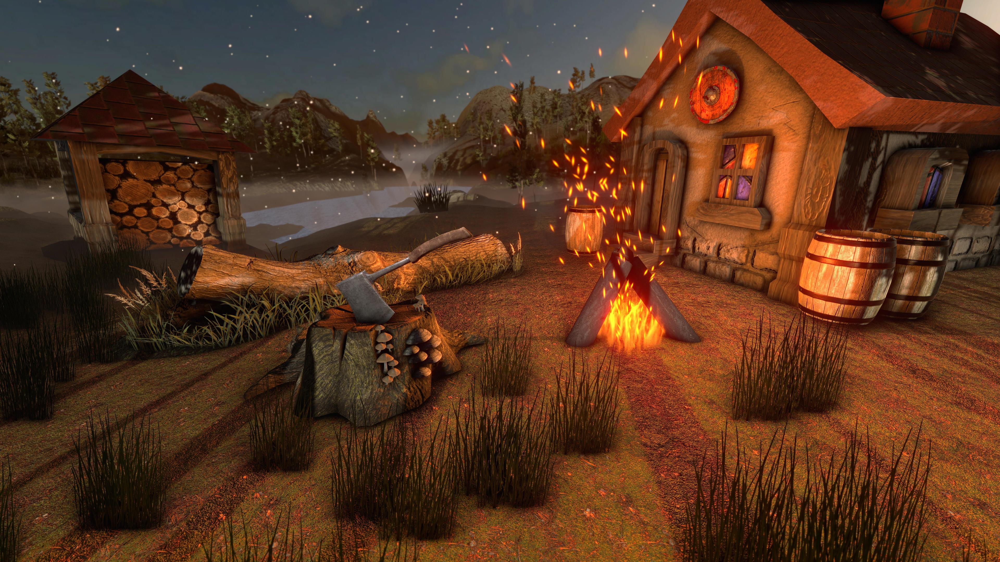

**Video**

    <iframe style="position:absolute;top:0;left:0;width:100%;height:100%;" src="https://www.youtube-nocookie.com/embed/1sNtYfWZV08" frameborder="0" allow="accelerometer; autoplay; encrypted-media; gyroscope; picture-in-picture" allowfullscreen></iframe>

## Reverse Maze

> `Unity 2019.1.14f1` `Bosca Ceoil` `AI` `NavMesh` - August 2019

Movement was created using Unity’s [NavMesh](https://docs.unity3d.com/Manual/nav-BuildingNavMesh.html), and the soundtrack atmosphere was made with [Bosca Ceoil](https://boscaceoil.net/).

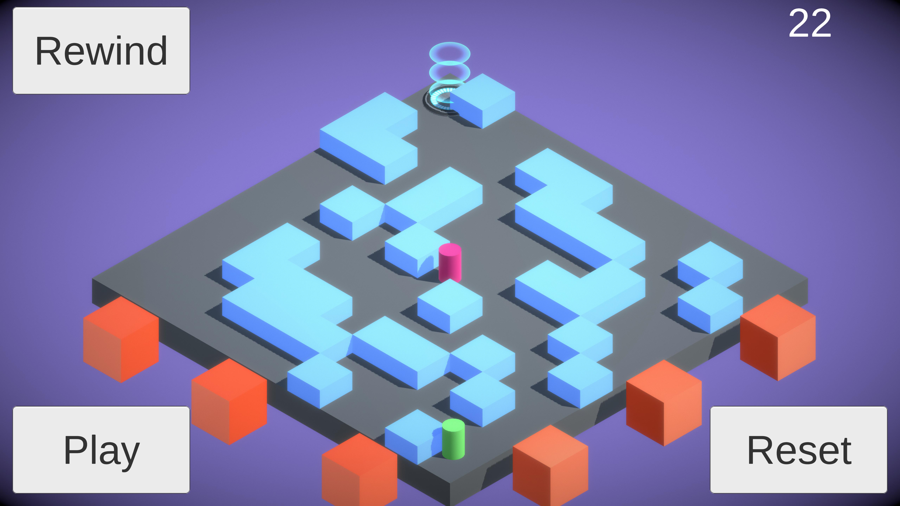

**Video with soundtrack**

<video controls width="500"><source :src="$withBase('/videos/aiMaze.webm')" type="video/webm">
    Sorry, your browser doesn't support embedded videos.
</video>

## Rolling in Retro Mode
Unity 2019.1.13f1 - August 2019

A rolling ball, but how do you make the concept more interesting?

Synthwave!

- Use of perspectives simulating endless forward motion
- The ball interacts with the ground and tries to find the best path forward
- Arches creating a sense of movement
- [Online version](https://lefebvre.dev/demo_unity_80s_WebGL/index.html) (the ground is different because of a shader incompatibility in WebGL)
- Code available on [GitHub](https://github.com/SamLefebvre/retro-80s-wireframe)

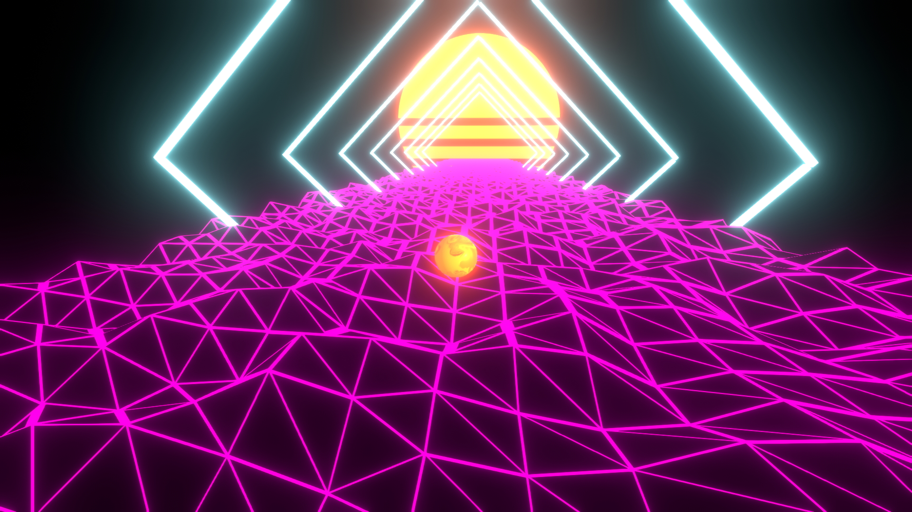

## Musical Interface
Unity 2019.1.1f1 - August 2019

As part of my course *GTI745 - Advanced User Interfaces* at ÉTS, the final lab project was to create a game that lets users make music. A great team effort completed in only a few weeks.

**Main interface**: A music sequencer with a console for adjusting the sound.

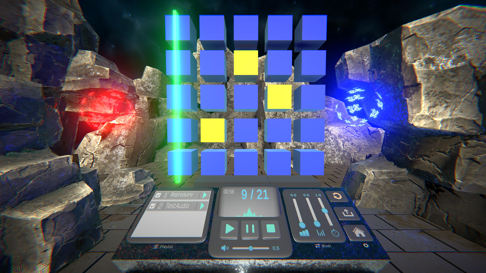

**Demo on YouTube**

    <iframe style="position:absolute;top:0;left:0;width:100%;height:100%;" src="https://www.youtube-nocookie.com/embed/UJGDZKN5E0o" frameborder="0" allow="accelerometer; autoplay; encrypted-media; gyroscope; picture-in-picture" allowfullscreen></iframe>

- Use of [Leap Motion](https://www.leapmotion.com/), allowing the matrix elements to be controlled in real time with our hands for a more immersive experience.

**A (small) world to explore**: The player has to move around a 3D world to collect different musical elements.  
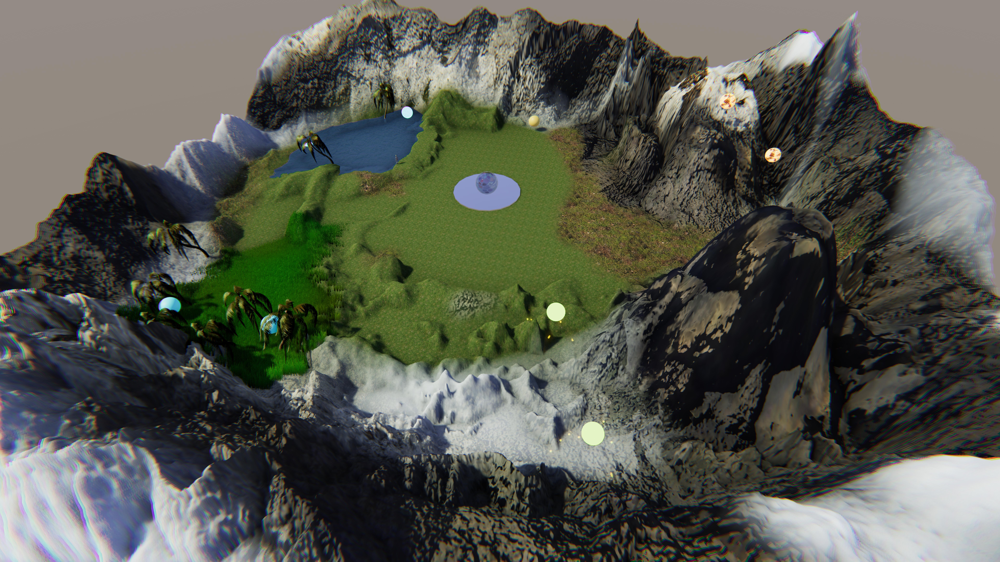

- [Terrain Tools](https://docs.unity3d.com/Packages/com.unity.terrain-tools@latest) package
- [Terrain Tools Sample Asset Pack](https://assetstore.unity.com/packages/2d/textures-materials/terrain-tools-sample-asset-pack-145808)

**Haptic device (vibration)**: Gives the user a small physical sensation when they "touch" an object, more specifically when the *Leap Motion* comes into contact with an element of the matrix.  
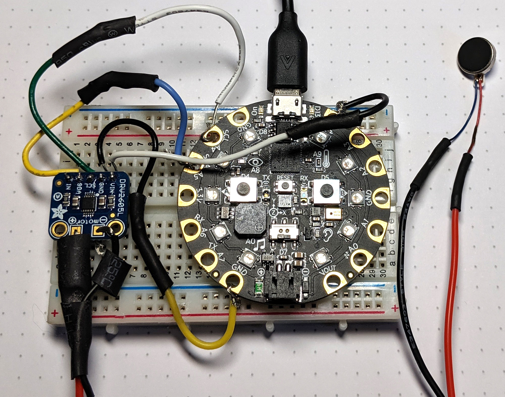

- Vibrotactile motor controlled with Python on an embedded system
  - [Vibrating Mini Motor Disc](https://www.adafruit.com/product/1201)
  - [Adafruit DRV2605L Haptic Motor Controller](https://www.adafruit.com/product/2305)
  - [Circuit Playground Express](https://www.adafruit.com/product/3333)

**Electrical circuit diagram**  
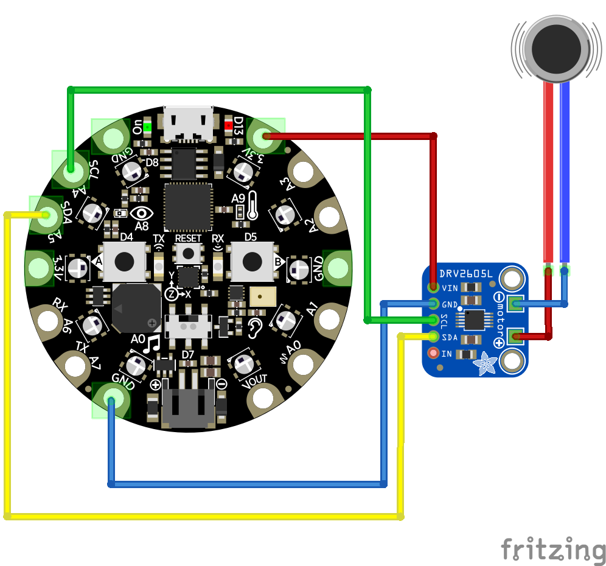

- Drawn using [Fritzing](https://fritzing.org/home/)