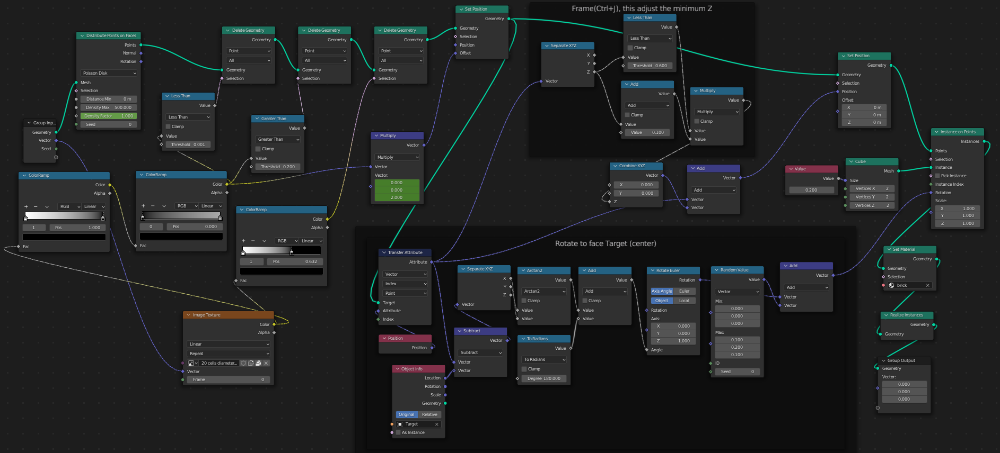

# Dynamic maze with Blender

`Geometry Node`, `Blender`, `Procedural Generations`

In this Blender project, the goal was to dynamically produce a maze based on an image using Blender's Geometry Node. 
The black and white areas of the image are extracted to produce a height map, and it is through these locations that the cubes are placed.
The cubes are then aligned towards the middle to produce a circle effect.

Partie Geometry Node

