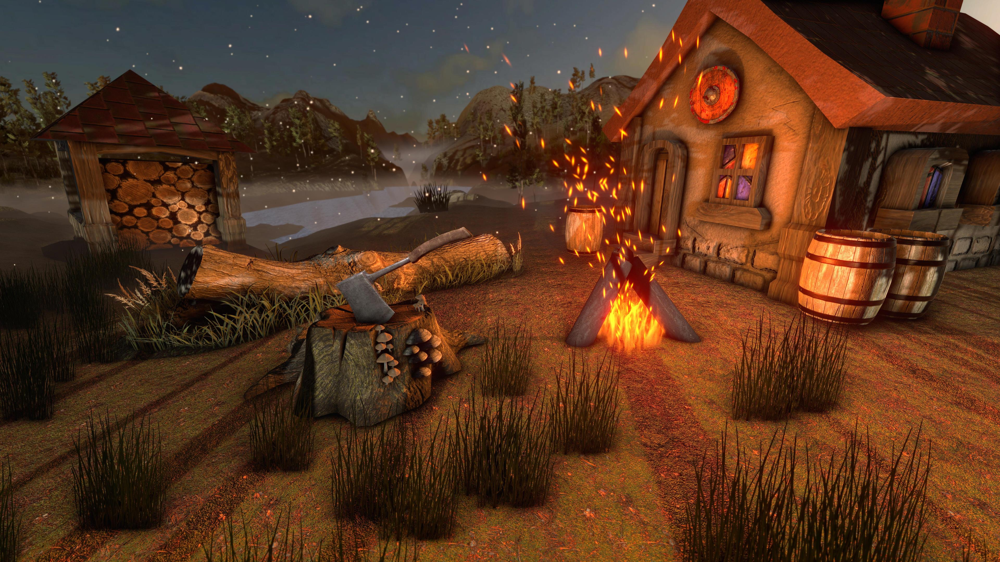
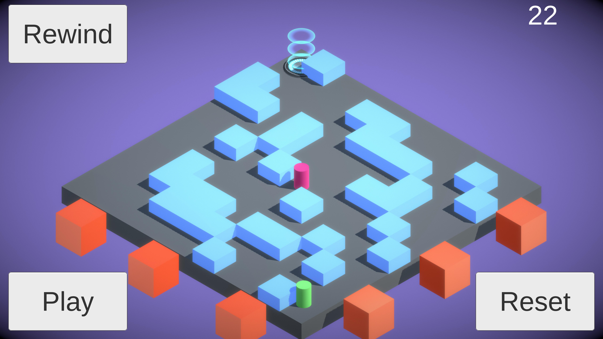
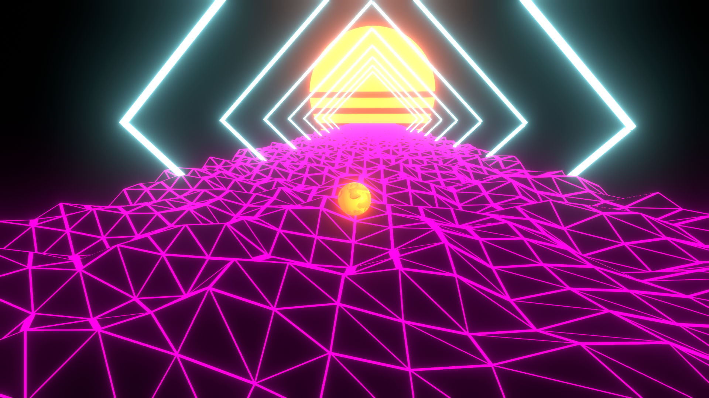
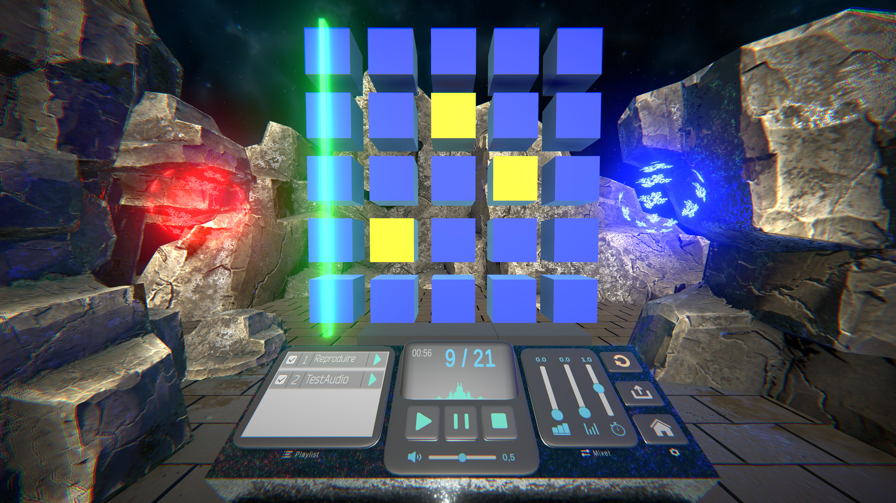
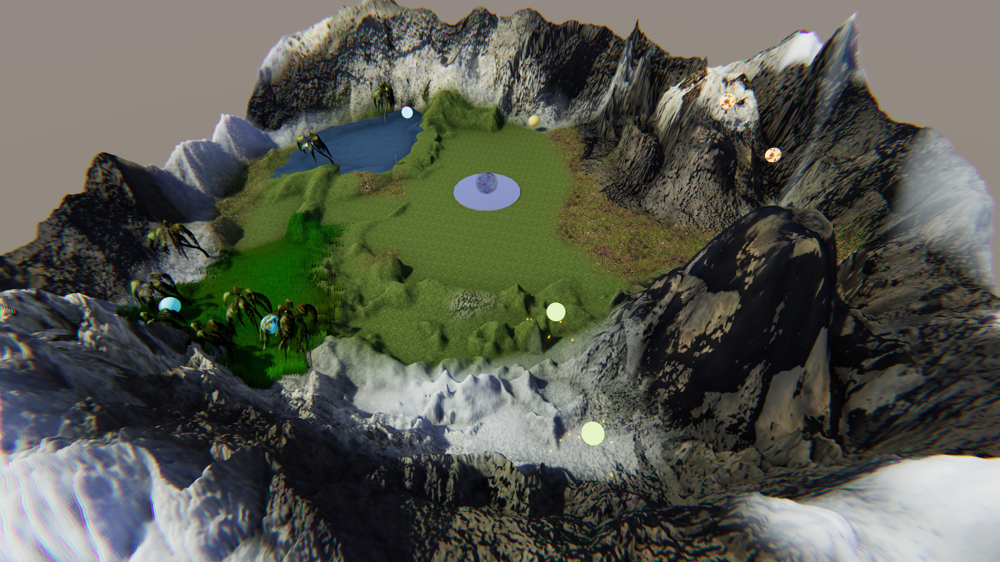
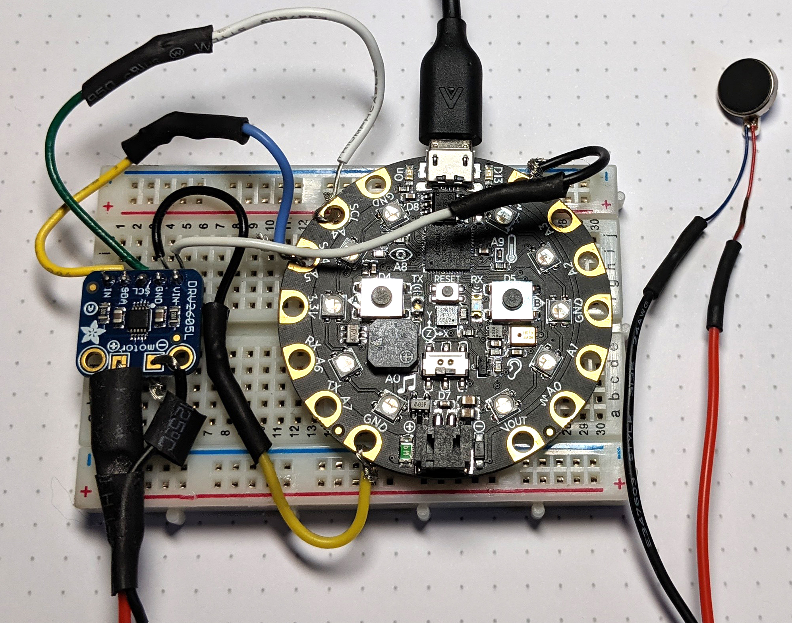
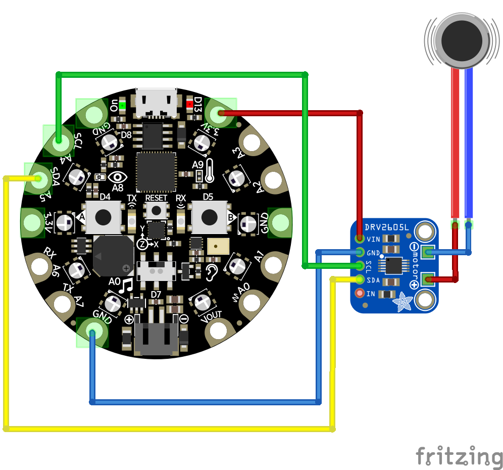
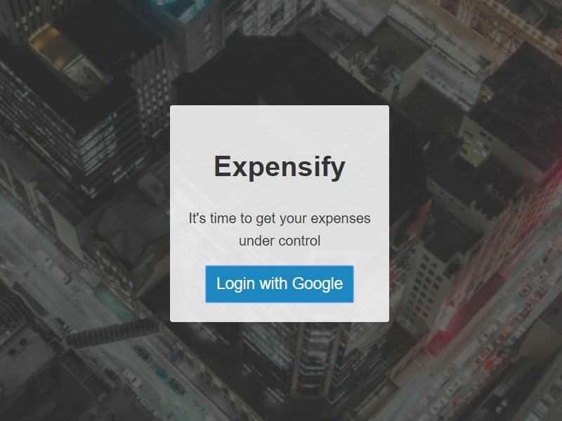
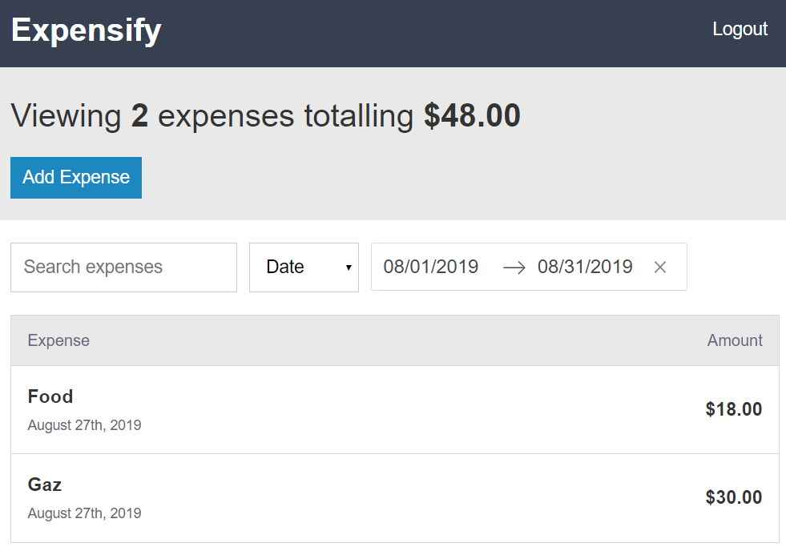
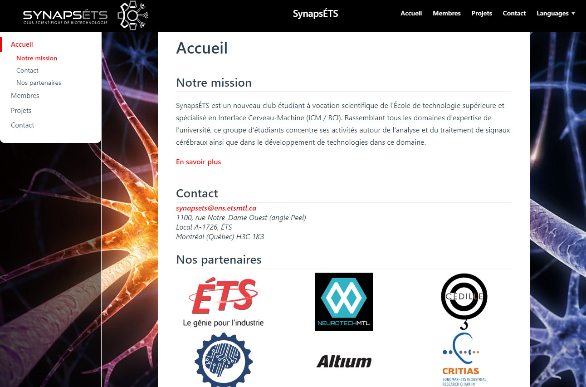

# Portfolio

## Unity

### Une fin de semaine au chalet
> `Unity 2019.1.14f1`

>*À quoi ressemblerait une fin de semaine idéale ?*
Être tranquille au chalet, un petit feu de camp, écouter la nature et s'assoupir lors d'un coucher de soleil.

Complêtement réalisé avec des assets gratuit, son d'ambiance enregistré moi-même et nettoyé avec Audacity.

**Vidéo**

    <iframe style="position:absolute;top:0;left:0;width:100%;height:100%;" src="https://www.youtube.com/embed/1sNtYfWZV08" frameborder="0" allow="accelerometer; autoplay; encrypted-media; gyroscope; picture-in-picture" allowfullscreen></iframe>

### Labyrinthe inversé

> `Unity 2019.1.14f1` `Bosca Ceoil` `AI` `NavMesh` - Août 2019

Mouvement avec le [NavMesh](https://docs.unity3d.com/Manual/nav-BuildingNavMesh.html) d'Unity et création d'une ambiance sonore avec [Bosca Ceoil](https://boscaceoil.net/).

::: warning En développement
Une mise à jour avec le lien sur le Google Play Store est à venir.
:::

**Vidéo avec la bande sonore**
<video width="100%" height="100%" controls>
  <source src="./img/aiMaze/video_aiMaze.webm" type="video/mp4">
  Your browser does not support the video tag.
</video>

### Rouler en mode rétro
Unity 2019.1.13f1 - août 2019

Une bille qui roule, comment rendre le concept plus intéressant ? 

Synthwave !

- Utilisation de perspectives simulant un avancement sans fin
- La bille intéragie avec le sol et essaie de trouver le meilleure chemin pour avancer
- Arches donnant une sensations d'avancement
- [Version en ligne](https://lefebvre.dev/demo_unity_80s_WebGL/index.html) (le sol est différent dû à une incompatibilitée avec le shader en WebGL)
- Code disponible sur [GitHub](https://github.com/SamLefebvre/retro-80s-wireframe)

### Interface musicale 
Unity 2019.1.1f1 - août 2019

Dans le cadre de mon cours *GTI745 - Interfaces utilisateurs avancées* à l'ÉTS, le dernier laboratoire a été de faire un jeu permettant de créer de la musique. Un magnifique travail d'équipe en seulement quelques semaines.

**Interface principale** : Séquenceur musical avec une console permettant d'ajuster le son.

**Démo sur Youtube**

    <iframe style="position:absolute;top:0;left:0;width:100%;height:100%;" src="https://www.youtube.com/embed/UJGDZKN5E0o" frameborder="0" allow="accelerometer; autoplay; encrypted-media; gyroscope; picture-in-picture" allowfullscreen></iframe>

- Utilisation de [Leap Motion](https://www.leapmotion.com/), permettant de contrôler les éléments de la matrices en temps réel avec nos mains pour un contrôle plus immersif.

**Un (petit) monde à explorer** : Le joueur doit se promener dans un monde 3d pour ramasser différents éléments musicaux.

- Package [Terrain Tools](https://docs.unity3d.com/Packages/com.unity.terrain-tools@latest)
- [Terrain Tools Sample Asset Pack](https://assetstore.unity.com/packages/2d/textures-materials/terrain-tools-sample-asset-pack-145808)

**Dispositif haptique (vibration)** : Permets de donner une petite sensation à l'utilisateur lorsqu'il "touche" à un objet, plus précisément lorsque la *Leap Motion* rentre en contact avec un élément de la matrice.

- Moteur vibrotactile contrôlé avec python sur système embarqué
  - Vibrating Mini Motor Disc  https://www.adafruit.com/product/1201
  - Adafruit DRV2605L Haptic Motor Controller https://www.adafruit.com/product/2305
  - Circuit Playground Express https://www.adafruit.com/product/3333

**Diagramme du circuit électrique**

- Dessiné à l'aide de [Fritzing](https://fritzing.org/home/)

## Site Internet

### [Expensify](https://cryptic-woodland-49105.herokuapp.com)

> `React`

Fait en suivant le cours [The Complete React Developer Course](https://www.udemy.com/react-2nd-edition) de React sur Udemy.

- React 16.8.6
- Login avec Firebase
- Test automatisé avec [Enzyme](https://airbnb.io/enzyme/)

### [SynapsÉTS](https://synapsets.etsmtl.ca)

> `Vuepress` `GitHub Page`

SynapsÉTS est un nouveau club étudiant à vocation scientifique de l'École de technologie supérieure et spécialisé en Interface Cerveau-Machine (ICM / BCI). Rassemblant tous les domaines d'expertise de l'université, ce groupe d'étudiants concentre ses activités autour de l'analyse et du traitement de signaux cérébraux ainsi que dans le développement de technologies dans ce domaine.

