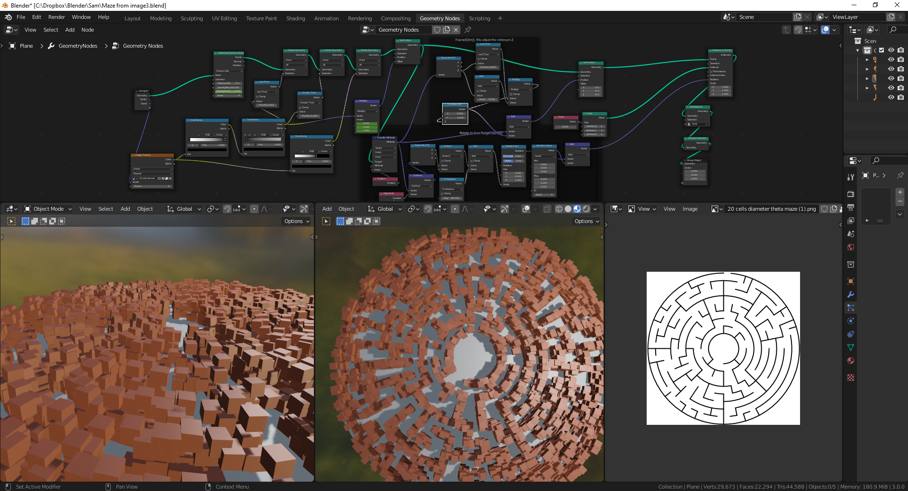

# Labyrinthe dynamique avec Blender

`Geometry Node`, `Blender`, `Génération Procedurale`

Dans ce projet Blender, le but a été de produire de façon dynamique un labyrinthe en se basant sur une image utilisant le Geometry Node de Blender. 
Les zones noirs et blanc de l'image sont extraites pour produire une carte de hauteur, et c'est par ces emplacements que les cubes sont placés.
Les cubes sont ensuite alignés vers le milieu pour produire un effet de cercle.

Partie Geometry Node

